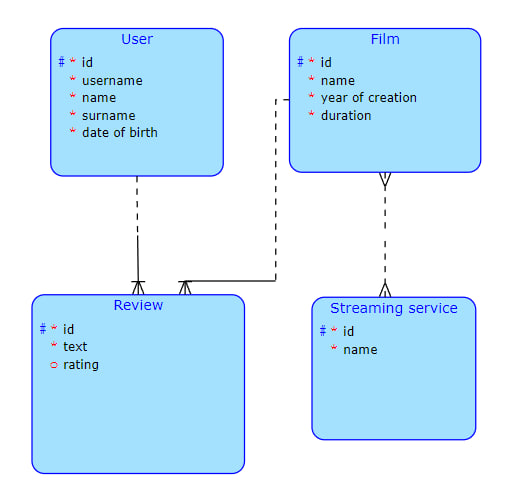

<b>TJV semestrální práce</b>

Film review system, where users can write reviews of films and then the application can count their rating.
DB has 4 Entities: Film, User, Review and StreamingService.
In the client, all the CRUD operations are implemented, as well as an additional business operation.

Business operation: A sorted list of streaming services by their "rating" (It depends on ratings of films that are on that streaming service).

Everything is done using Spring framework and the client is made with ReactJS.

DB's model:

